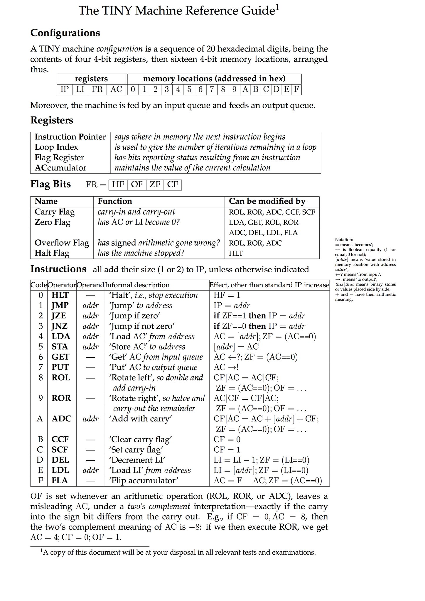

### Tiny Machine
#### Spenser Reinhardt <commiebstrd@protonmail.com>

This challenge is a 4-bit CPU and memory emulator that can be run in a variety of difficulty levels.

* Easy
  - [X] Debug binaries with named symbols
  - [X] Operational error messages returned to user
  - [X] Simplistic final state resolution (input buffer w/ flag -> output buf)
* Medium
  - [X] Optimized and striped symbols
  - [X] Simpler/removing error messages outside of resolution
  - [X] Complex final state dependent on register/memory state
* Hard
  - [X] Release+ optimized and striped symbols
  - [X] Remove all error and debug output (forcing live debugging to determine state)
  - [ ] Additional/alternative instructions
  - [ ] Altering endianness

#### Reference material




#### Getting running

```sh
# Install gui deps (client builds)
sudo apt install \
    cmake libxcb-xkb-dev libfontconfig1-dev libgles2-mesa-dev \
    libfreetype6-dev libexpat-dev
# Install rustup
sudo apt-get install build-essential software-properties-common -y
curl https://sh.rustup.rs -sSf | sh
rustup default nightly
# build and generate md5sum for dns and client binary
cd TinyMachine/
cargo build --release --features ""
#lvl 2 and 3
strip target/release/tiny_machine
md5sum ./target/release/tiny_machine
cp ./target/release/tiny_machine ~/tiny_machine-noflag
# Build executable
cargo build --release --features "real_flag"
cp ./target/release/tiny_machine ~/tiny_machine
# add user
useradd -m -U tinymachine -s /bin/false
# copy binary to directory
sudo cp ./target/release/tiny_machine /home/tinymachine/
sudo chown tinymachine:tinymachine /home/tinymachine/tiny_machine
sudo chmod 540 /home/tinymachine/tiny_machine
```
* Add systemd service `/etc/systemd/system/tinymachine.service`
```
[Unit]
Description=Executes TinyMachine CTF challenge
Wants=network.target
After=network.target

[Service]
User=tinymachine
Group=tinymachine
WorkingDirectory=~
ExecStart=/home/tinymachine/tiny_machine
Restart=always
RestartSec=10

[Install]
WantedBy=multi-user.target
```
* Start and enable
  ```sh
  sudo systemctl start tinymachine
  sudo systemctl enable tinymachine
  ```

#### 300

Title: TinyMachine 1

Is this some sort of small emulator? Who left this thing on!? Sure are a lot of functions, wonder what kind of binary this is?

Try at: `300bcc4101e7955589bde7bdcd9cafe6.bsides.40bytectf.com:12346`

Points: 300
Flag: `40ByteCTF{H0w_m4ny_0pc0des_t0_4_tinyM4chine?}`

Client build command: `cargo build --release  --features "lvl1"` 300bcc4101e7955589bde7bdcd9cafe6
Server build command: `cargo build --release  --features "lvl1 real_flag"`

#### 400

Title: TinyMachine 2

Look there's another one! This one doesn't seem so friendly... Maybe it has builtin help when running locally?

Try at: `bsides.40bytectf.com:45678`

Points: 400
Flag: `40ByteCTF{B3_0n3_w1th_th3_bs1d3s!}`
Client build command: `cargo build --release --features "lvl2"; strip target/release/tiny_machine_2`
Server build command: `cargo build --release --features "lvl2 real_flag"; strip target/release/tiny_machine_2`

#### 500

Title: TinyMachine 3

Not again!! Something seems really DIFFerent

Try at: `bsides.40bytectf.com:61830`

Points: 500
Flag: `40ByteCTF{4r3nt_n3w_4rch1t3cur3s_fun?!}`
Client build command: `cargo build --release --features "lvl3"; strip target/release/tiny_machine_3`
Server build command: `cargo build --release --features "lvl3 real_flag"; strip target/release/tiny_machine_3`
